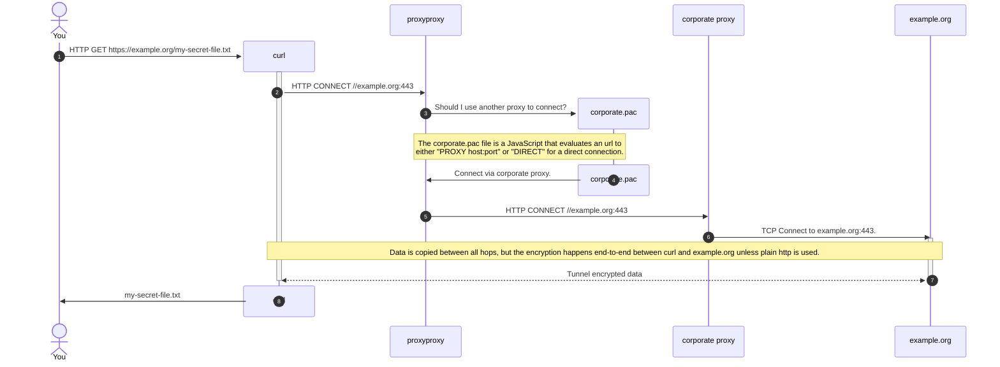

# proxyproxy

An http proxy to proxy another http proxy 🤪

## Usecase

Imagine you worked for a company that only allowed internet traffic through an http proxy and
rolled it out via pac[^1] file. Now imagine that most programs under linux do not support pac.

Some of us don't have to imagine that.

This application acts as a proxy between applications and the corporate http proxy.
This way, applications can use environment variables[^2] to route their traffic through proxyproxy,
which in turn understands the pac file and routes the traffic to the desired upstream proxy.



## Configuration

The easiest way to get going is via docker or podman:

```sh
docker run
  -p 54321:8080
  -v /:/auto-configure-root
  -e PROXYPROXY_AUTOCONFIGURE_CONFIG_ADDR=localhost:54321
  -e PROXYPROXY_PAC_URL=http://my-company.org/corporate.pac
  ghcr.io/lukasdietrich/proxyproxy:latest
```

### Autoconfiguration

The host needs to be configured to use proxyproxy as the http(s) proxy.
If you mount `/auto-configure-root` known paths are configured automatically:

| Path                                   | Description                                                              |
|:---------------------------------------|:-------------------------------------------------------------------------|
| /etc/apt/apt.conf.d/99-proxyproxy.conf | Set `Acquire::http::Proxy` and `Acquire::https::Proxy`                   |
| /etc/profile.d/99-proxyproxy.sh        | Set the environment variables `http_proxy`, `https_proxy` and `no_proxy` |


[^1]: https://developer.mozilla.org/en-US/docs/Web/HTTP/Guides/Proxy_servers_and_tunneling/Proxy_Auto-Configuration_PAC_file
[^2]: https://everything.curl.dev/transfers/conn/proxies.html?highlight=https_proxy#proxy-environment-variables
