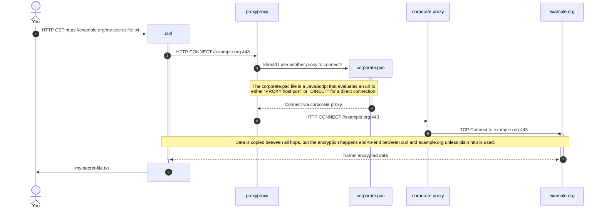

# proxyproxy

An http proxy to proxy another http proxy 🤪

## Usecase

Imagine you worked for a company that only allowed internet traffic through an http proxy and
rolled it out via pac[^1] file. Now imagine that most programs under linux do not support pac.

Some of us don't have to imagine that.

This application acts as a proxy between applications and the corporate http proxy.
This way, applications can use environment variables[^2] to route their traffic through proxyproxy,
which in turn understands the pac file and routes the traffic to the desired upstream proxy.

[^1]: https://developer.mozilla.org/en-US/docs/Web/HTTP/Guides/Proxy_servers_and_tunneling/Proxy_Auto-Configuration_PAC_file
[^2]: https://everything.curl.dev/transfers/conn/proxies.html?highlight=https_proxy#proxy-environment-variables
